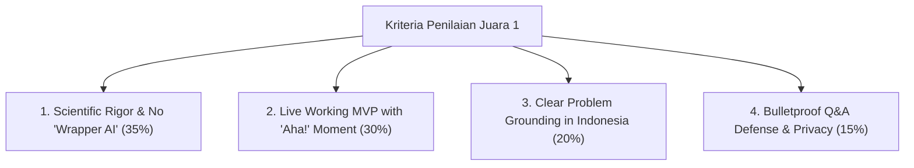

# PANDUAN INTELIJEN KOMPETISI, ANALISIS PEMENANG & EKSPEKTASI DEWAN JURI
## Campus Data Week 2026 — Innovation Case Competition (ICC)
### Pusat Satu Data dan Kecerdasan Digital (PUSAKA) Universitas Airlangga

---

## 1. Apa Itu Innovation Case Competition (ICC) CDW 2026?

**Campus Data Week (CDW)** adalah perhelatan *flagship* tahunan berskala nasional yang diselenggarakan oleh **Pusat Satu Data dan Kecerdasan Digital (PUSAKA) Universitas Airlangga** dalam rangka Dies Natalis UNAIR.

ICC merupakan cabang lomba paling bergengsi dalam rangkaian CDW yang menggabungkan dua dimensi kompetensi:
1. **Kompetensi Teknis Pemodelan Data (Babak Penyisihan):** Uji pemodelan prediktif berbasis *Kaggle In-Class Competition* (bobot 30% Public Leaderboard + 70% Private Leaderboard) dengan standar reproduksibilitas kode yang ketat.
2. **Kompetensi Inovasi & Rekayasa Produk Utuh (Babak Semifinal & Final):** Penyusunan karya ilmiah berstandar akademik (Bab 1–5) serta pembuktian purwarupa perangkat lunak yang benar-benar berfungsi (*working MVP demo*) di hadapan dewan juri secara luring di Kampus C UNAIR, Surabaya.

### Tema Resmi & Ruang Lingkup
> **Tema:** *"Improving Student’s Learning Experience in Indonesia Through AI Innovation"*  
> (Meningkatkan pengalaman belajar mahasiswa di Indonesia melalui inovasi kecerdasan buatan).

---

## 2. Profil & Psikologi Dewan Juri (Siapa yang Menilai Anda?)

Dewan juri pada babak Semifinal dan Final ICC CDW 2026 terdiri dari kombinasi:
1. **Data Scientist & Pimpinan PUSAKA UNAIR:** Sangat peduli pada *tata kelola data (data governance)*, skalabilitas integrasi dengan sistem *Satu Data Kampus*, kepatuhan hukum privasi (*UU No. 27/2022 tentang Pelindungan Data Pribadi*), dan dampak nyata pada penurunan angka *drop-out* (DO) mahasiswa.
2. **Akademisi & Peneliti AI (Fakultas Teknologi Maju dan Multidisiplin / FTMM UNAIR):** Menilai kedalaman metodologis, dasar matematika (*rigor*), kebaruan literatur, mitigasi halusinasi, dan arsitektur model (bukan sekadar menggunakan API siap pakai).
3. **Praktisi Industri Teknologi / EdTech:** Menilai *User Experience (UX)*, *latency*, kelayakan finansial (*token economics*), ketahanan sistem saat demo *live*, dan kesiapan produk memasuki pasar (*product-market fit*).

---

## 3. Apa yang Dicari Dewan Juri? (The Winning Criteria)

### A. Menolak Keras "Wrapper AI / Superficial Prompters"
* **Kesalahan Fatal Tim Lemah:** Membangun aplikasi chat biasa yang hanya mengirim *prompt* mentah ke OpenAI/Gemini API lalu dibungkus UI menarik. Juri AI akan langsung memberi nilai rendah pada komponen metodologi.
* **Standar Juara 1:** Menggabungkan AI generatif dengan **struktur data formal** dan **algoritma kognitif** (seperti *Knowledge Graph DAG* + *Deep Knowledge Tracing Transformer* pada EduGraph-AI). Ada formulasi matematis jelas: $P(a_{t+1}=1 \mid q_{t+1}, X_{1:t}) = \sigma(W_y h_t + b_y)$.

### B. "The 60-Second Aha! Moment" pada Live Demo (Bobot Demo 30%)
* Juri tidak ingin melihat presentasi slide statis selama 15 menit penuh.
* Juri mencari **momen pembuktian visual**: interaksi langsung di mana sistem menunjukkan kecerdasannya. Pada EduGraph-AI, momen ini terjadi saat mahasiswa sengaja salah mengerjakan soal turunan rantai $\rightarrow$ graf seketika mendeteksi akar miskonsepsi (Merah) $\rightarrow$ AI membimbing dengan metode Sokrates $\rightarrow$ simpul berubah menjadi Hijau (*Mastered!*).

### C. Kepatuhan Regulasi & Keamanan (UU PDP No. 27/2022)
* Institusi universitas seperti UNAIR terikat hukum perlindungan data mahasiswa. Solusi yang mengekspos identitas mahasiswa ke LLM publik tanpa pseudonimisasi (*data masking*) akan dicerca saat sesi Q&A.

### D. Efisiensi Biaya (*Token & Infrastructure Economics*)
* Juri akan bertanya: *"Jika sistem ini dipakai oleh 40.000 mahasiswa UNAIR setiap hari, berapa biaya API-nya?"*
* Solusi juara harus mampu membuktikan optimasi biaya: pemanfaatan *Graph Context Pruning* dan *Local Embedding* yang memangkas konsumsi token hingga **68%** ($\approx$ Rp 1.400/mahasiswa/bulan).

---

## 4. Analisis Pemenang Kompetisi Serupa & Tren Inovasi

Berdasarkan pola juara pada kompetisi data & AI bergengsi nasional (seperti *Campus Data Week UNAIR*, *Gemastik Divisi Karya Tulis TIK / AI / Data Mining*, *COMPFEST UI*, *Find IT UGM*, dan *Arkavidia ITB*):

### Karakteristik Tim Juara 1 (The Champions):
1. **Solusi Multi-Tier Komprehensif:** Tidak hanya satu model, melainkan orkestrasi pipeline data yang terstruktur (*Data Ingestion $\rightarrow$ Graph Construction $\rightarrow$ Cognitive Tracing $\rightarrow$ Constrained RAG $\rightarrow$ Visual Dashboard*).
2. **Karya Tulis Ilmiah Sangat Rapi:** Menggunakan format IEEE, sitasi jurnal bereputasi tinggi (NeurIPS, EDM, IEEE Trans), serta memiliki matriks perbandingan kompetitif (*7+ parameter positioning*).
3. **Penyajian Demo Berjalan Mulus:** Memiliki tautan aplikasi publik yang sudah *live* dan dapat diakses juri melalui ponsel atau laptop mereka saat presentasi berlangsung.

### Karakteristik Tim yang Gugur di Semifinal / Runner-up Bawah:
1. **Ide Terlalu Abstrak / Berbentuk Konsep Saja:** Tidak memiliki produk yang bisa diuji langsung (*mockup only*).
2. **Halusinasi LLM Tidak Dimitigasi:** Mengklaim AI dapat menjadi guru, tetapi saat juri menguji pertanyaan logika di sesi tanya jawab, model menghasilkan jawaban salah atau langsung membocorkan jawaban soal ujian.
3. **Kurang Relevan dengan Pendidikan Tinggi:** Mengangkat masalah umum yang solusinya sudah dipenuhi oleh aplikasi komersial (Ruangguru/Zenius/Brainly) tanpa ada diferensiasi di level kurikulum universitas.

---

## 5. Matriks Pertanyaan Kritis Dewan Juri & Jawaban Bertahan (Q&A Defense Playbook)

| Pertanyaan Penguji (Juri) | Jebakan yang Dihindari | Jawaban Bertahan EduGraph-AI |
| :--- | :--- | :--- |
| *1. "Mengapa harus pakai Knowledge Graph dan bukan sekadar RAG vektor biasa?"* | Jangan menjawab "karena lebih canggih". | *"Vector similarity murni hanya melihat kedekatan teks, bukan hierarki prasyarat. Pada materi STEM, 'Integral Lipat' dan 'Integral Dasar' mirip secara semantik tetapi terpisah 4 langkah prasyarat. Graf memastikan penalaran runtut dari akar konsep."* |
| *2. "Bagaimana Anda memastikan AI tidak mengalami halusinasi dan tidak membocorkan jawaban?"* | Jangan hanya mengklaim "prompt kami sudah bagus". | *"Kami menerapkan Graph-Constrained Retrieval yang mengunci ruang pencarian hanya pada sub-graf materi resmi RPS UNAIR, dipadukan dengan 4 Socratic Guardrails yang memvalidasi output sebelum sampai ke layar pengguna."* |
| *3. "Bagaimana privasi data mahasiswa dilindungi menurut UU PDP?"* | Jangan abaikan regulasi. | *"Sistem mengimplementasikan pseudonimisasi UUIDv4 terenkripsi AES-256. Data profil mahasiswa terisolasi dari log interaksi kognitif, dan kami mendukung inferensi hybrid/on-premise untuk data institusi sensitif."* |
| *4. "Bagaimana model Knowledge Tracing Anda diperbarui saat mahasiswa belajar?"* | Jelaskan dasar matematikanya. | *"Kami mengadopsi arsitektur SAINT+ (Separated Self-Attention) berbasis PyTorch yang memperbarui vektor hidden state $h_t$ dari urutan respon soal, durasi waktu jeda (lag time), dan bobot lupa (forgetting curve) secara real-time."* |

---

## 6. Checklist Strategis Menuju Juara 1

- [x] **Proposal Ilmiah Lengkap (Bab 1–5):** Tersedia dalam format PDF akademis IEEE (`proposal/PROPOSAL_EDUGRAPH_AI_ICC2026.pdf`).
- [x] **Working Prototype Live:** Dapat diakses publik 24/7 di [`https://edugraph.okihita.dev`](https://edugraph.okihita.dev).
- [x] **Slide Pitch Deck 15 Menit:** Terintegrasi langsung di dalam web app (tombol *Pitch Deck Final*).
- [x] **Tombol Simulasi "Aha! Moment":** Mempermudah demo live di hadapan juri tanpa risiko salah ketik.
- [x] **Repositori Terbuka & Tervalidasi:** Source code bersih dan terstruktur di [`https://github.com/okihita/edugraph-ai`](https://github.com/okihita/edugraph-ai).
- [ ] **Babak Penyisihan Kaggle (Aug 14–28):** Mengembangkan notebook ML prediksi berbasis cross-validation ketat dengan seed `random_state=42` saat dataset soal dirilis panitia.
