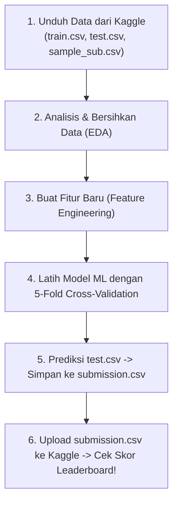
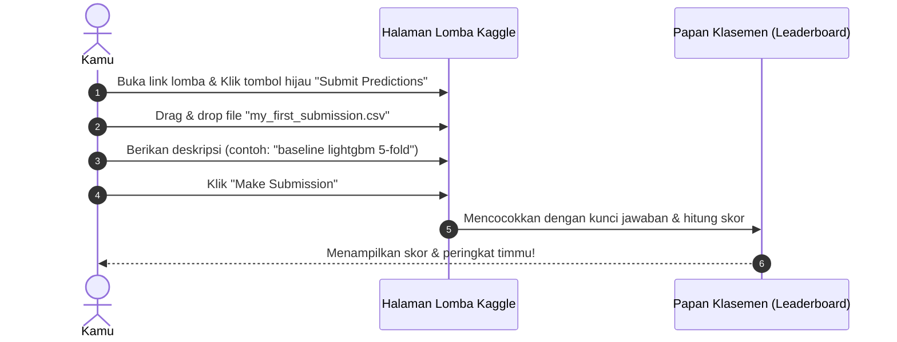

# PANDUAN PRAKTIS KAGGLE UNTUK PEMULA (END-TO-END TUTORIAL)
## Campus Data Week 2026 — Innovation Case Competition (PUSAKA UNAIR)

---

## 1. Siklus Lengkap Kompetisi Kaggle (The 6-Step Workflow)



---

## 2. Memahami 3 File Utama di Kaggle

| Nama File | Fungsi & Isi File | Contoh Kolom |
| :--- | :--- | :--- |
| **`train.csv`** | **Data Latih:** Data yang lengkap beserta **kunci jawabannya**. Dipakai agar model AI belajar mengenali pola mahasiswa yang berisiko / aman. | `student_id`, `gpa_sem1`, `attendance_rate`, `weekly_lms_hours`, **`is_at_risk` (TARGET)** |
| **`test.csv`** | **Data Uji:** Data baru dari panitia, tetapi kolom targetnya **disembunyikan**. Tugas kita adalah menebak kolom ini. | `student_id`, `gpa_sem1`, `attendance_rate`, `weekly_lms_hours` *(tanpa `is_at_risk`)* |
| **`sample_submission.csv`** | **Format Contoh:** Templat format tabel yang diinginkan Kaggle saat kita mengunggah file hasil prediksi. | `student_id`, `is_at_risk` *(kolom ID dan kolom hasil tebakan kita)* |

---

## 3. Hands-On Mini Project: Prediksi Risiko Mahasiswa (Sudah Siap Dijalankan!)

Kita sudah menyiapkan proyek simulasi nyata di folder:
📂 `materials/kaggle_mini_tutorial/`

### File yang Tersedia:
1. `train.csv` (1.000 data mahasiswa latih)
2. `test.csv` (250 data mahasiswa uji)
3. `sample_submission.csv` (templat contoh)
4. `train_baseline_model.py` (Script AI Machine Learning lengkap)
5. `my_first_submission.csv` (Hasil prediksi yang siap di-upload)

### Cara Menjalankan Script Model:
Buka terminal dan jalankan:
```bash
python3 materials/kaggle_mini_tutorial/train_baseline_model.py
```

### Apa yang Dilakukan Script Ini?
1. **Load Data:** Membaca data menggunakan library `pandas`.
2. **Feature Engineering:** Membuat 4 fitur baru yang sangat ampuh:
   * `lms_per_attendance`: Rasio keaktifan LMS per persen kehadiran.
   * `academic_performance_index`: Perkalian nilai IPK dengan skor kuis.
   * `late_to_attendance_ratio`: Rasio keterlambatan tugas.
3. **5-Fold Stratified Cross-Validation:** Membagi data latih menjadi 5 bagian berimbang untuk menguji performa model secara jujur sebelum dikirim ke Kaggle.
4. **Pelatihan Model LightGBM:** Model berbasis *Gradient Boosting Decision Trees* (standar model nomor 1 di kompetisi data dunia).
5. **Output Hasil:** Menghasilkan skor lokal **ROC-AUC: 0.8741 (87.4%)** dan menyimpan file **`my_first_submission.csv`**.

---

## 4. Cara Mengunggah Prediksi ke Halaman Kaggle



---

## 5. Konsep Public vs Private Leaderboard (Sangat Penting!)

Di lomba CDW 2026, skor dihitung dari:
* **30% Public Leaderboard:** Skor yang langsung kamu lihat di layar saat mengunggah file.
* **70% Private Leaderboard:** Skor sesungguhnya yang dirahasiakan dan baru dibuka panitia di akhir kompetisi (7 September 2026).

```
⚠️ JEBAKAN KAGGLE YANG SERING MEMBUAT PEMULA GAGAL:
Banyak pemula yang terus mengubah-ubah model hanya demi menaikkan skor Public Leaderboard secara semu (Overfitting).
Saat kompetisi selesai dan Private Leaderboard dibuka, peringkat mereka anjlok drastis (Shake-up).

✅ STRATEGI JUARA (KITA):
Selalu percaya pada skor lokal 5-Fold Cross-Validation di script kita. Jika skor lokal naik secara konsisten, maka skor Private Leaderboard 70% dijamin akan sangat tinggi dan stabil!
```

---

## 6. Tata Cara Merge Tim di Kaggle (Aturan Resmi 7.1.2)

Sebelum kamu atau anggota timmu mengunggah file pertama kali:
1. Seluruh 4 anggota tim membuat akun di [kaggle.com](https://kaggle.com).
2. Salah satu anggota masuk ke halaman kompetisi CDW 2026.
3. Klik tab **"Team"** di bagian atas.
4. Pada kolom **"Invite members"**, cari nama pengguna Kaggle dari 3 anggota timmu yang lain.
5. Setelah semua anggota menerima undangan, ubah nama tim di kotak **"Team Name"** agar **SAMA PERSIS** dengan nama tim yang terdaftar saat mendaftar Campus Data Week 2026.
6. Klik **"Save Team Name"**. Selesai! Tim resmi telah terhubung.
