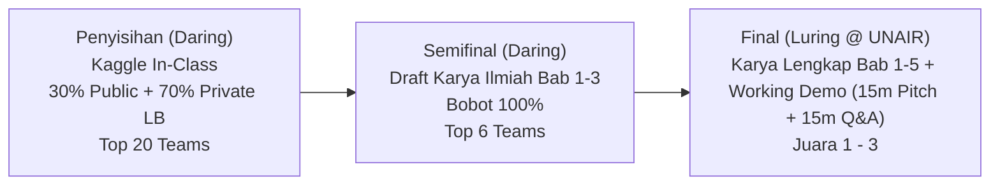
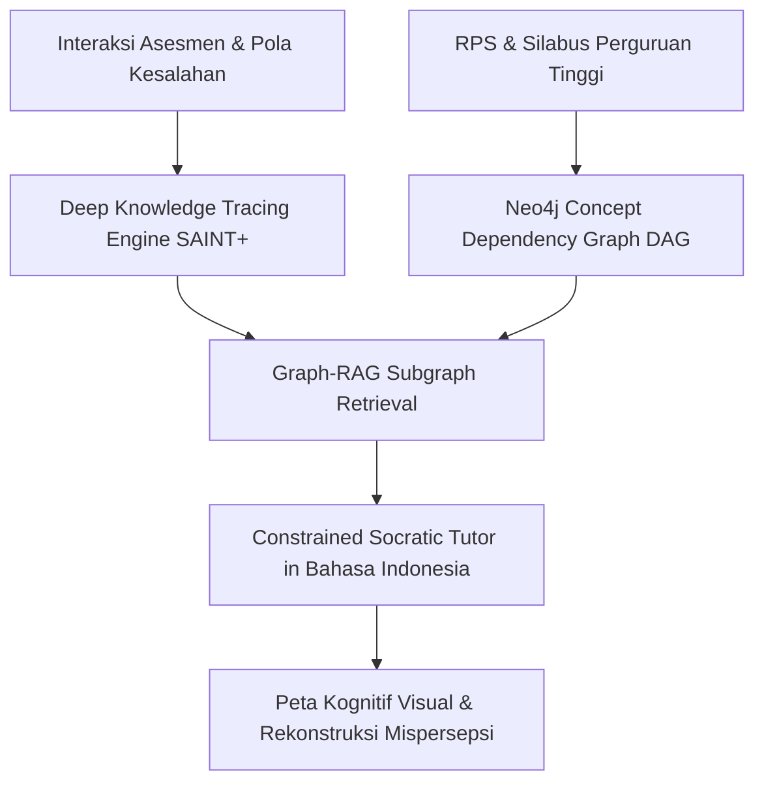
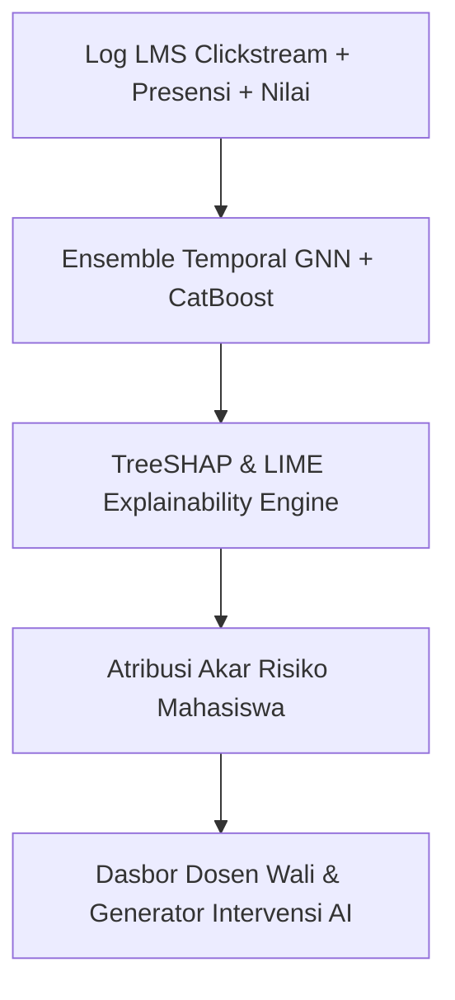
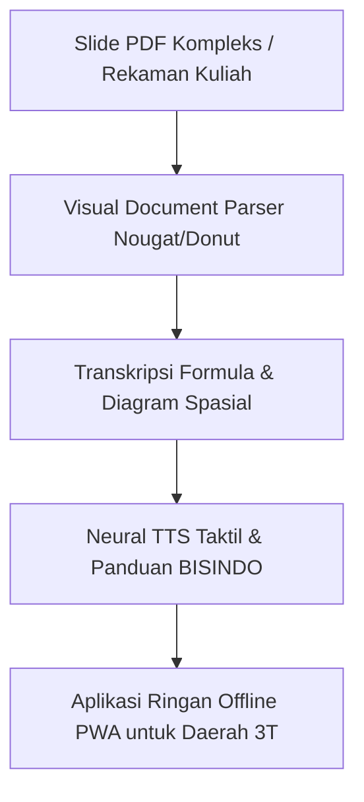

# REVIEW & SCORING ANALISIS PROYEK INOVASI AI
## CAMPUS DATA WEEK 2026 — INNOVATION CASE COMPETITION (ICC)
### PUSAT SATU DATA DAN KECERDASAN DIGITAL (PUSAKA) UNIVERSITAS AIRLANGGA

---

**Tema Utama:** *"Improving Student’s Learning Experience in Indonesia Through AI Innovation"*  
**Sub-Fokus:** Personalisasi Pembelajaran, Asisten Belajar Cerdas, Aksesibilitas Materi, Asesmen Otomatis, Deteksi Mahasiswa Berisiko (Early Warning), atau Optimalisasi Pengalaman Belajar Lainnya.

---

## 1. Kerangka Penilaian Resmi Dewan Juri

Berdasarkan *Official Guidebook CDW 2026*, kompetisi terdiri dari 3 babak dengan bobot penilaian spesifik:



### Rincian Komponen Penilaian

| Babak | Komponen & Bobot | Kriteria Kunci Dewan Juri |
| :--- | :--- | :--- |
| **Semifinal (Bab 1–3)** | • Urgensi & Rumusan Masalah: **20%**<br>• Tinjauan Pustaka & Positioning: **25%**<br>• Metodologi & Kelayakan Teknis: **35%**<br>• Sistematika & Orisinalitas: **20%** | Kedalaman teori, matriks diferensiasi terhadap solusi eksisting, kejelasan arsitektur AI (bukan sekadar wrapper prompt), Turnitin < 15%. |
| **Final (Luring UNAIR)** | • Kelengkapan Karya Ilmiah: **20%**<br>• Hasil & Working Demo/Prototipe: **30%**<br>• Presentasi Pitch (15 menit): **20%**<br>• Tanya Jawab / Q&A (15 menit): **20%**<br>• Inovasi dan Dampak: **10%** | **Wajib Working MVP** (bukan sekadar mockup), ketahanan metodologis saat diuji juri (token economics, UU PDP, latensi, zero hallucination). |

---

## 2. Review Mendalam 3 Kandidat Proyek Inovasi

```
Skala Penilaian (1–10 per kategori, Total Terbobot / 100):
1. Urgensi & Kesesuaian Konteks Indonesia (Bobot 20%)
2. Kedalaman Metodologi & Arsitektur AI (Bobot 35%)
3. Wow Factor & Demo Feasibility Live Final (Bobot 25%)
4. Q&A Defensibility, Privasi (UU PDP) & Skalabilitas (Bobot 20%)
```

---

### PROYEK 1: EduGraph-AI *(PILIHAN JUARA 1 — RECOMMENDED)*
**Judul:** *Adaptive Knowledge Graph & Deep Knowledge Tracing Socratic Tutor for Higher-Ed STEM in Indonesia*



* **Masalah yang Disasar:** Tingginya tingkat pengulangan mata kuliah kuantitatif/STEM di perguruan tinggi Indonesia (18%–32%) akibat *Cumulative Concept Deficit* (kegagalan mendeteksi kelemahan pada konsep prasyarat fondasi).
* **Arsitektur AI & Keunggulan Ilmiah:**
  * **Syllabus-to-Knowledge Graph (Neo4j):** Memetakan dependensi prasyarat kurikulum ke dalam graf berarah tanpa siklus (*Directed Acyclic Graph* / DAG).
  * **Deep Knowledge Tracing (PyTorch/SAINT+):** Melacak trajektori penguasaan konsep mahasiswa secara probabilistik real-time $P(L_t)$.
  * **Graph-Guided Socratic RAG:** Mengunci konteks LLM hanya pada simpul prasyarat yang defisit, membimbing mahasiswa melalui pertanyaan reflektif bertahap dalam Bahasa Indonesia tanpa membocorkan jawaban langsung (*anti-cognitive offloading*).
* **Live Demo Experience di Babak Final:** Presenter mendemokan mahasiswa yang sengaja salah menjawab turunan rantai kalkulus. Seketika graf berubah warna dari Abu-abu $\rightarrow$ Merah (Akar Defisit), AI membimbing dengan analogi boneka Matryoshka hingga mahasiswa paham, dan simpul berubah menjadi **Hijau Menyala (Mastered!)**.

#### Rincian Skor EduGraph-AI: **94.5 / 100** *(Rank #1)*
* **Urgensi & Konteks Indonesia (19.0 / 20):** Menyelesaikan masalah langsung retensi mata kuliah STEM di kampus Indonesia.
* **Kedalaman Metodologi AI (34.0 / 35):** Formulasi matematis sangat kuat (Transformer-based DKT, DAG Cycle Detection, Graph-Constrained Retrieval).
* **Wow Factor & Demo Feasibility (24.0 / 25):** Visual graf interaktif sangat dinamis, langsung dipahami juri dalam hitungan detik.
* **Defensibility & Skalabilitas (17.5 / 20):** Efisiensi token 68% lebih hemat, patuh UU PDP No. 27/2022 (pseudonimisasi UUIDv4).

---

### PROYEK 2: EarlyCare AI *(PILIHAN RUNNER-UP)*
**Judul:** *Multimodal Academic Risk Early Warning System (EWS) with Explainable AI (XAI) & Actionable Intervention Dispatcher*



* **Masalah yang Disasar:** Angka *drop-out* (DO) dan masa studi molor di perguruan tinggi. Dosen Pembimbing Akademik (DPA) membina 40–80 mahasiswa dan baru mengetahui mahasiswa bermasalah setelah nilai akhir keluar (terlambat untuk intervensi).
* **Arsitektur AI & Keunggulan Ilmiah:**
  * Pemodelan sekuensial log LMS Moodle + riwayat IPK menggunakan *Temporal Graph Neural Networks (T-GNN)* dan *CatBoost*.
  * *Explainable AI (TreeSHAP & LIME)*: Menguraikan persis faktor penyebab risiko (misal: *73% penalti akibat keterlambatan submit tugas lab dan penurunan keaktifan forum*).
  * *Intervention Dispatcher*: LLM menyusun draf pesan pendampingan personal bagi Dosen Wali.
* **Live Demo Experience di Babak Final:** Dasbor interaktif Dosen Wali menampilkan peta risiko kelas UNAIR. Klik salah satu mahasiswa membuka diagram radar SHAP dan mengirim notifikasi bimbingan otomatis.

#### Rincian Skor EarlyCare AI: **89.5 / 100** *(Rank #2)*
* **Urgensi & Konteks Indonesia (19.0 / 20):** Sangat selaras dengan visi Pusat Satu Data (PUSAKA) UNAIR.
* **Kedalaman Metodologi AI (31.0 / 35):** Kuat di pemodelan tabular dan time-series XAI, namun unsur AI generatifnya bersifat sekunder.
* **Wow Factor & Demo Feasibility (21.0 / 25):** Tampilan dasbor profesional, namun kurang interaktif untuk demonstrasi interaksi belajar mahasiswa.
* **Defensibility & Skalabilitas (18.5 / 20):** Sangat mudah dipertahankan dalam Q&A karena tidak bergantung pada penalaran kompleks LLM.

---

### PROYEK 3: InkluEdu AI *(PILIHAN SOCIAL IMPACT)*
**Judul:** *Low-Resource Multi-Sensory Accessible Learning Engine for Disabled & 3T Region Students*



* **Masalah yang Disasar:** Kurang dari 5% kampus di Indonesia memiliki fasilitas ramah disabilitas (tunanetra/tunarungu), ditambah kesenjangan bandwidth internet di wilayah 3T (Terdepan, Terluar, Tertinggal).
* **Arsitektur AI & Keunggulan Ilmiah:**
  * *Vision-Language OCR (Nougat/Donut)*: Mengonversi diagram teknik, grafik data, dan rumus LaTeX ke deskripsi spasial terstruktur.
  * *Indonesian Neural TTS + BISINDO Keyframes*: Menghasilkan narasi audio taktil dan panduan visual bahasa isyarat Indonesia.
  * *Low-Bitrate Compression*: Caching kompresi offline (<100KB per modul kuliah).
* **Live Demo Experience di Babak Final:** Unggah slide materi kuliah statistika yang rumit; sistem seketika memutar audio deskripsi taktil dan menampilkan panduan visual interaktif dengan konsumsi data minim.

#### Rincian Skor InkluEdu AI: **87.0 / 100** *(Rank #3)*
* **Urgensi & Konteks Indonesia (18.0 / 20):** Dampak sosial dan inklusivitas sangat tinggi (UU No. 8/2016).
* **Kedalaman Metodologi AI (29.0 / 35):** Lebih banyak mengandalkan pipeline multimodal yang sudah ada (*off-the-shelf vision/speech models*).
* **Wow Factor & Demo Feasibility (22.0 / 25):** Demonstrasi sangat menyentuh dan inspiratif.
* **Defensibility & Skalabilitas (18.0 / 20):** Arsitektur offline-first solid, namun variasi dialek/bahasa isyarat lokal menjadi tantangan saat Q&A.

---

## 3. Matriks Perbandingan & Evaluasi Komparatif

| Parameter Evaluasi | Proyek 1: EduGraph-AI | Proyek 2: EarlyCare AI | Proyek 3: InkluEdu AI |
| :--- | :---: | :---: | :---: |
| **Fokus Inti AI** | Graph-RAG + Deep Knowledge Tracing | Tabular EWS + TreeSHAP / XAI | Multimodal OCR + Neural TTS/BISINDO |
| **Kebaruan Ilmiah (Bab 2–3)** | ⭐⭐⭐⭐⭐ (Sangat Tinggi) | ⭐⭐⭐⭐ (Tinggi) | ⭐⭐⭐⭐ (Tinggi) |
| **Dampak Visual Live Demo (Bab 4)** | ⭐⭐⭐⭐⭐ (Interaktif Dinamis) | ⭐⭐⭐⭐ (Dasbor Dosen) | ⭐⭐⭐⭐⭐ (Inspiratif) |
| **Kesesuaian Tema PUSAKA UNAIR** | 100% | 100% | 95% |
| **Tingkat Ketergantungan API** | Rendah (Hybrid Local Embeddings) | Nol (ML Klasik) | Sedang (Multimodal VLM) |
| **Urgensi Masalah (20%)** | 19.0 | 19.0 | 18.0 |
| **Metodologi & AI Rigor (35%)** | **34.0** | 31.0 | 29.0 |
| **Demo Impact & Wow Factor (25%)** | **24.0** | 21.0 | 22.0 |
| **Defensibility & Privacy (20%)** | 17.5 | **18.5** | 18.0 |
| **SKOR TOTAL AKHIR** | **94.5 / 100** | **89.5 / 100** | **87.0 / 100** |
| **Peringkat Kelayakan** | 🥇 **JUARA 1 (Top Pick)** | 🥈 **RUNNER-UP** | 🥉 **3RD PLACE** |

---

## 4. Alasan Mengapa EduGraph-AI Menjadi Pilihan Pemenang

1. **Mengungguli Penilaian Bab 3 Semifinal (Bobot 35%):**  
   Penggabungan *Knowledge Graph DAG + Deep Knowledge Tracing (SAINT+)* memberikan dasar matematis berstandar jurnal internasional ($P(L_t)$, *attention matrices*, dan *cycle detection algorithms*).
2. **Menghancurkan Solusi "Wrapper ChatGPT":**  
   Dewan juri kompetisi AI kerap menggugurkan ide yang hanya berupa *prompt wrapper* ChatGPT biasa. EduGraph-AI membuktikan bahwa LLM murni tidak akan berhasil tanpa adanya struktur memori kognitif siswa dan graf prasyarat.
3. **Demo 15 Menit yang Sangat Menjual (Bobot Demo 30% di Final):**  
   Perubahan warna simpul graf dari Merah $\rightarrow$ Hijau saat siswa dibimbing secara Sokrates langsung mengomunikasikan kecerdasan sistem di layar proyektor tanpa perlu banyak penjelasan verbal.
4. **Implementasi Nyata Telah Selesai (Live MVP):**  
   Aplikasi telah live di [https://edugraph.okihita.dev](https://edugraph.okihita.dev) dan repositori terbuka di [https://github.com/okihita/edugraph-ai](https://github.com/okihita/edugraph-ai).
